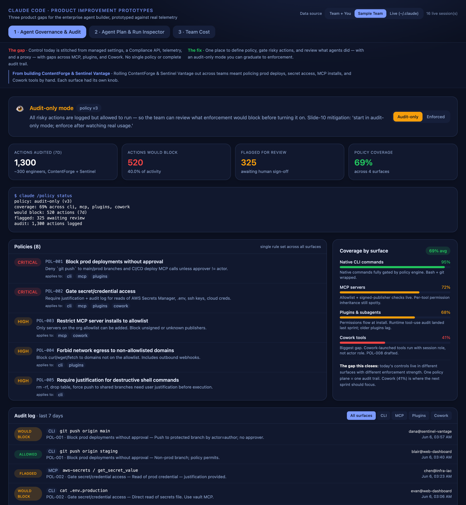
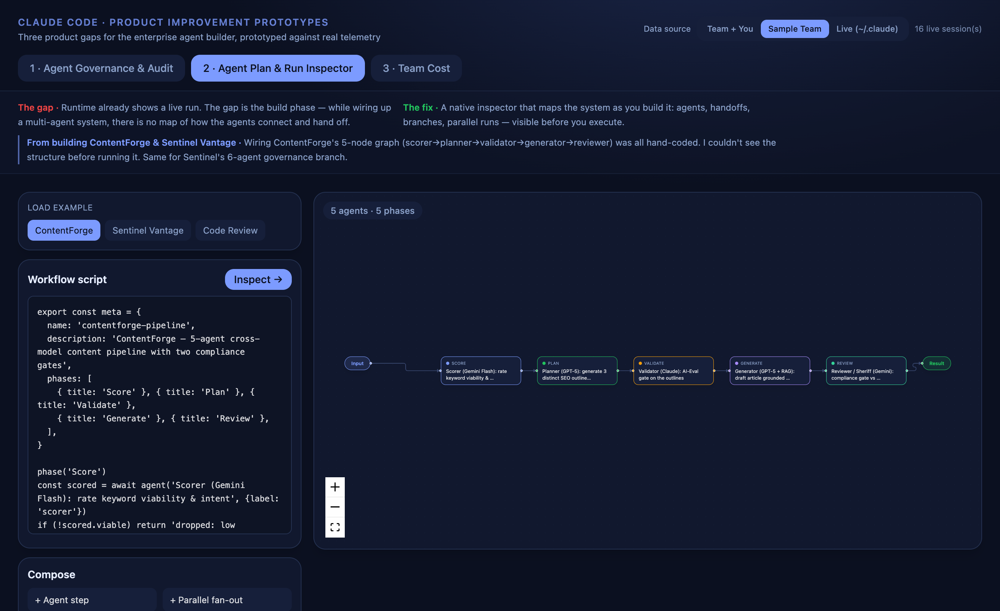
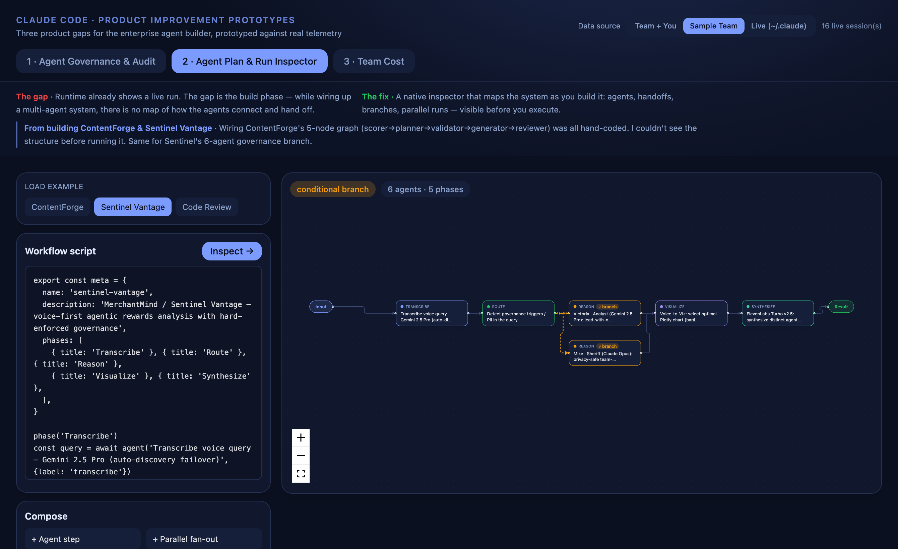
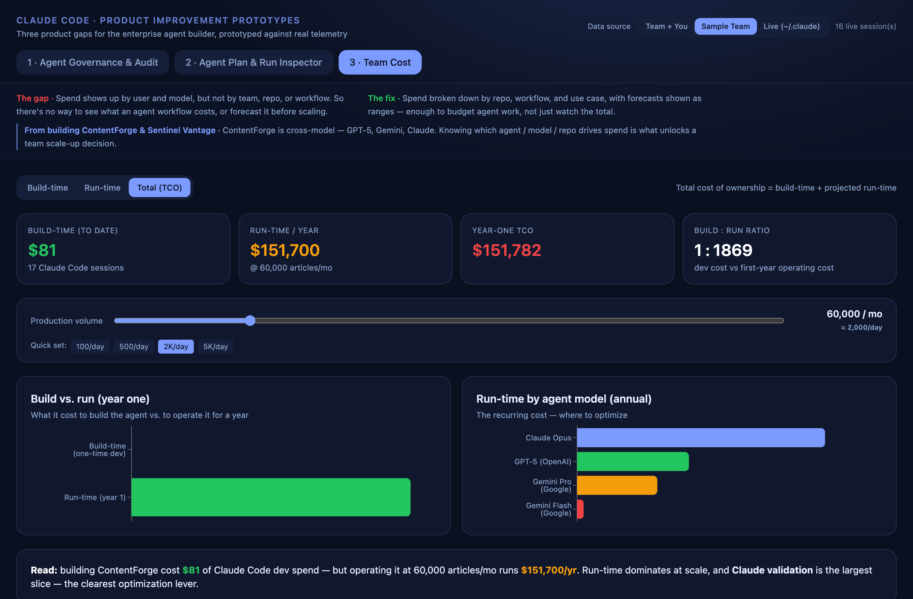
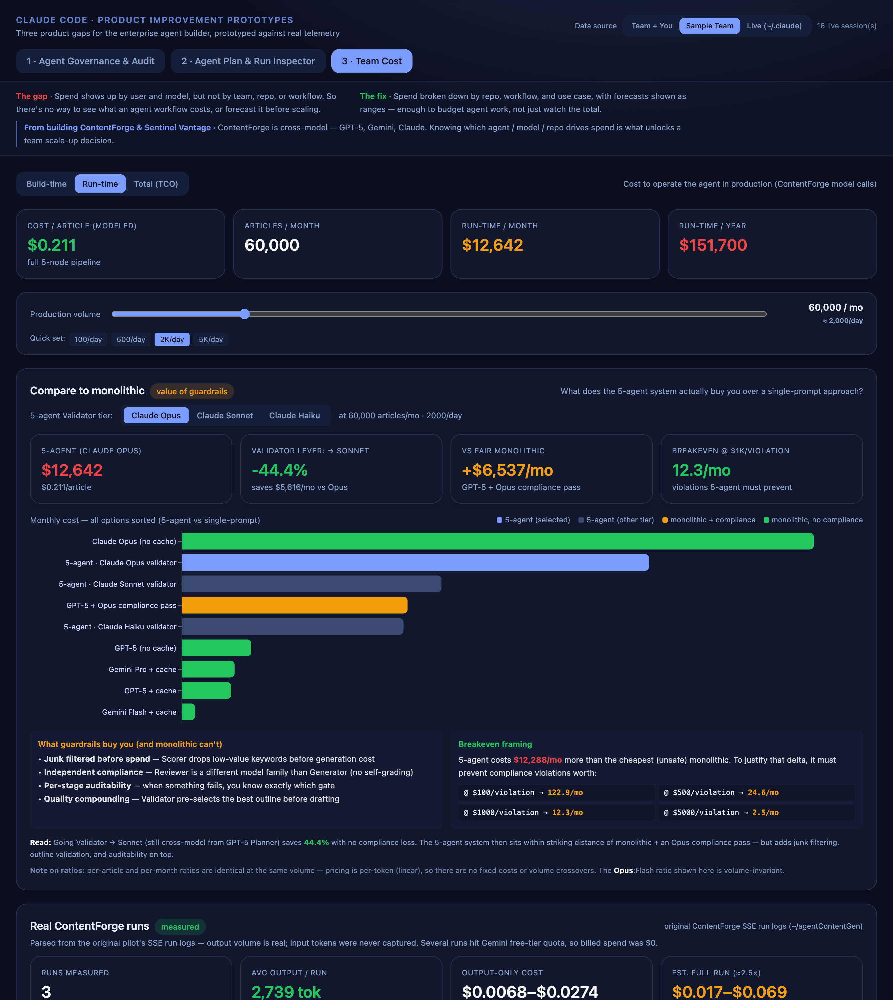

# Claude Code — Product Improvement Prototypes

Three working prototypes proposing product improvements to Claude Code, framed for the **enterprise agent builder** — a platform/DevEx lead rolling Claude Code out across an org of engineers building multi-agent systems. Each maps a **real gap** to a **concrete fix**, validated against two shipped pilots: **ContentForge** (5-agent cross-model content pipeline) and **Sentinel Vantage** (6-agent voice-first agentic system with a PII→Sheriff governance branch).

Where possible, the prototypes are grounded in **real telemetry Claude Code already emits** — its `~/.claude` JSONL session transcripts (per-turn token usage, model, repo path, git branch, timestamps) — with a synthetic team dataset as a fallback so it runs on any laptop.

| Priority | Pain point | Prototype |
|---|---|---|
| **P0** | No defensible control or audit of what agents do — policy is stitched from managed settings, a Compliance API, telemetry, and a proxy with gaps across MCP, plugins, and Cowork | **Agent Governance & Audit** — one policy plane, risky-action gating, complete audit trail, and an audit-only → enforced graduation path |
| **P1** | No way to see how agents fit together while building | **Agent Plan & Run Inspector** — visualize the multi-agent system as you design it: handoffs, branches, parallel fan-out — before execution |
| **P2** | No spend visibility by team, repo, or workflow | **Team Cost Attribution, Forecasting & TCO** — build-time dev spend + agent run-time cost = total cost of ownership; compare to monolithic baselines |

## Prioritization

The deck orders these by **cost of leaving them unsolved**: legal/compliance/reputation risk dominates, so Governance is P0. Inspector is real friction but lower risk than a compliance gap. Cost is a real gap in spend visibility but the least time-critical of the three. This is the enterprise order — for a solo developer, risk barely registers and it flips toward Inspector.

## Screenshots

### 1 · Agent Governance & Audit (P0)

Today's controls live in different surfaces — managed settings, Compliance API, telemetry, a proxy — with different enforcement strengths and no single audit trail. The prototype consolidates them into one policy plane with an **audit-only → enforced** toggle (the slide-10 mitigation: start in audit-only mode, enforce after watching real usage). Shows policies, a coverage map across CLI/MCP/Plugins/Cowork, the full audit log, and the `claude /policy status` view from the deck mock.



### 2 · Agent Plan & Run Inspector (P1)

Switch between bundled examples (ContentForge and Sentinel Vantage are real pilots; a code-review fan-out is a generic pattern), edit the script, or add steps — the DAG updates live. Conditional branches and parallel fan-outs render as diverging arrows.



The same inspector pointed at the second pilot — **Sentinel Vantage** (MerchantMind) — showing its PII→Sheriff governance **branch** (Route diverges to the Analyst and the Sheriff, then reconverges):



### 3 · Team Cost Attribution, Forecasting & TCO (P2)

Three modes:
- **Build-time** — dev spend by repo / use case / owner + forecast
- **Run-time** — agent operating cost, scaled by a production-volume control
- **Total (TCO)** — build-time + projected run-time, compared head-to-head



A **"Compare to monolithic"** panel answers the obvious probe — *is multi-agent worth it?* — by ranking the 5-agent system at three Validator tiers (Opus / Sonnet / Haiku) against every reasonable monolithic baseline, with a breakeven framing translating cost delta into compliance violations the multi-agent pipeline must prevent.

At 2K articles/day (60K/mo), against the cheapest unsafe monolithic (Flash + cache, **$0.0059/article · $354/mo**):

| 5-agent Validator tier | Per article | Monthly | × Flash |
|---|---|---|---|
| **Opus tier** | $0.2107 | $12,642 | **35.7×** |
| **Sonnet tier** | $0.1171 | $7,026 | **19.9×** |
| **Haiku tier** | $0.0999 | $5,996 | **16.9×** |

Two notes worth knowing if anyone probes the math:
- **Per-article ratio = per-month ratio at the same volume.** Pricing is per-token (purely linear) — no fixed costs or volume crossovers. The Opus:Flash ratio is 35.7× whether you run 3K/mo or 60K/mo.
- **The "fair" monolithic** (GPT-5 generation + Opus compliance pass) lands at **$6,105/mo** — within $1K of the 5-agent system at the Sonnet tier. Validator → Sonnet saves 44% from Opus without losing the cross-model judge property.
- **Breakeven**: at Opus tier, 5-agent costs **+$12,288/mo** over Flash — justified if it prevents **~12 compliance violations/mo at $1K each**.



> Tabs and data source are deep-linkable — e.g. `…/#governance`, `…/?example=sentinel#composer`, or `…/?mode=run&volume=60000#cost`.

## Approach

These are standalone prototypes, **not** edits to Claude Code's closed source. What grounds them: they read the product's *actual* data surface. The Cost prototype computes real numbers from `~/.claude` history (context-load growth, per-turn cost from token usage × list pricing). The Inspector parses real workflow scripts. The Governance prototype mirrors the policy-plane mock from the deck, populated with deterministic audit data that scales the synthetic 7-day window to a representative org of ~300 engineers. Toggle the **data source** (Team+You / Sample Team / Live) in the header.

## Architecture

```
backend/   FastAPI — reads ~/.claude transcripts, computes cost/governance state,
           parses workflow scripts, and serves the built frontend on one port
frontend/  React + Vite + Tailwind + Recharts + React Flow (3 tabs)
```

## Run (one port)

```bash
# 1. backend
cd backend
python3.12 -m venv venv && source venv/bin/activate
pip install -r requirements.txt

# 2. build the frontend once (served by the backend)
cd ../frontend && npm install && npm run build

# 3. launch — open http://localhost:8000
cd ../backend && uvicorn main:app --port 8000
```

For frontend hot-reload during development, run `npm run dev` (port 5180) in a second terminal — it proxies `/api` to the backend on 8000.

## Design principle

Across all three prototypes: **prefer honest signals over reassuring ones.** Governance defaults to audit-only because a clean-looking enforced policy is the kind of thing that hides legitimate workflows it would break. Forecasts in Cost are shown as ranges, not single numbers. The Inspector keeps the underlying script visible and editable next to the graph, so the visual layer can't hide what the system actually does.

## Notes

- Dollar figures use indicative published list pricing (see `backend/pricing.py`), isolated so they're easy to update.
- Zero real spend or API keys involved — everything is computed from local transcript token counts.
- Validated on two shipped pilots: ContentForge (5-agent) and Sentinel Vantage (6-agent).
