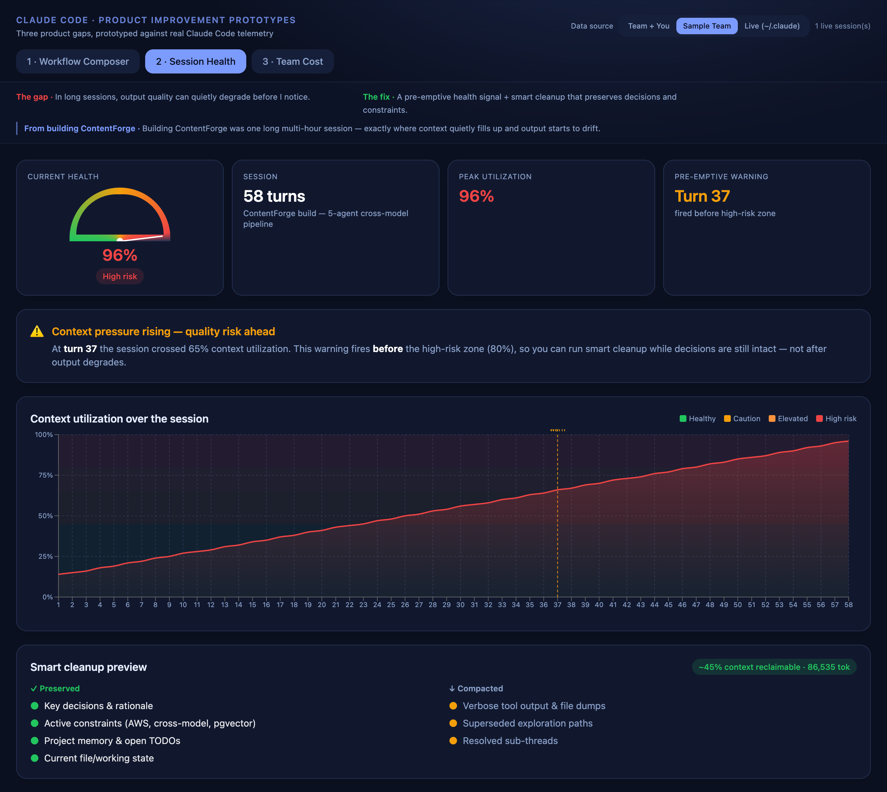

# Claude Code — Product Improvement Prototypes

Three working prototypes proposing product improvements to Claude Code. Each maps
a **real gap** in agentic development workflows to a **concrete fix**, and —
crucially — is prototyped against the **real telemetry Claude Code already emits**
(its `~/.claude` JSONL session transcripts: per-turn token usage, model, repo
path, git branch, timestamps), with a synthetic "team" dataset as a fallback so it
runs on any laptop.

| # | Pain point | Prototype |
|---|-----------|-----------|
| 1 | Can watch agents run, but can't shape how they fit together before they start | **Visual Workflow Composer & Inspector** — renders a workflow script as a DAG (phases, handoffs, parallel fan-out) *before* execution; compose steps and watch the graph update |
| 2 | In long sessions, output quality can quietly degrade before you notice | **Active Session Health** — a context-utilization gauge + zone timeline that fires a *pre-emptive* warning before the high-risk zone, plus a smart-cleanup preview that preserves decisions/constraints |
| 3 | As usage scales, spend is hard to attribute, predict, and compare to value | **Team Cost Attribution & Forecasting** — spend by repo / use case / owner + a run-rate forecast with a confidence band |

## Screenshots

**1 · Visual Workflow Composer & Inspector** — the dependency graph of a real multi-agent workflow (here, the ContentForge 5-node cross-model pipeline) rendered *before* execution. Edit the script or add steps and the DAG updates.


**2 · Active Session Health** — context-utilization gauge + zone timeline. The warning fires at **turn 37**, *before* the high-risk zone — so cleanup happens while decisions are still intact, not after output degrades. Smart-cleanup preview shows what's preserved vs. compacted.



**3 · Team Cost Attribution & Forecasting** — spend by repo / use case / owner, a 30-day forecast with a confidence band, and a **cross-model breakdown** (GPT-5 / Gemini / Claude) for the ContentForge pipeline — the view that answers "which model is driving cost, and is it worth it?"


> Tip: tabs and data source are deep-linkable — e.g. `…/#health` or `…/?source=sample#cost`.

## Approach

These are standalone prototypes, **not** edits to Claude Code's closed source.
What grounds them: they read the product's *actual* data surface. Prototypes 2 and 3
compute real numbers from `~/.claude` history (e.g. context-load growth,
per-turn cost from token usage × list pricing); prototype 1 parses real Workflow-tool
scripts. Toggle the **data source** (Team+You / Sample Team / Live) in the header.

## Architecture

```
backend/   FastAPI — reads ~/.claude transcripts, computes cost/health/forecast,
           parses workflow scripts, and serves the built frontend on one port
frontend/  React + Vite + Tailwind + Recharts + React Flow (3 tabs)
```

## Run (one port)

```bash
# 1. backend
cd backend
python3.12 -m venv venv && source venv/bin/activate
pip install -r requirements.txt

# 2. build the frontend once (served by the backend)
cd ../frontend && npm install && npm run build

# 3. launch — open http://localhost:8000
cd ../backend && uvicorn main:app --port 8000
```

For frontend hot-reload during development, run `npm run dev` (port 5180) in a
second terminal — it proxies `/api` to the backend on 8000.

## What each prototype shows

1. **Composer** — A workflow is written as code and only observable once it runs.
   The composer renders the dependency graph first — parallel fan-out, gates,
   handoffs — so the structure (and its cost) is reviewable *before* execution.
2. **Health** — Over a 58-turn session, context climbs from healthy to 96%. The
   warning fires at **turn 37**, *before* the high-risk zone, so cleanup happens
   while key decisions are still intact rather than after output degrades.
3. **Cost** — Per-session spend is fine for one person; a team needs spend by
   repo, use case, and engineer, plus a forecast range — the view that informs a
   scale-up decision.

## Notes

- Dollar figures use indicative published list pricing (see `backend/pricing.py`),
  isolated so they're easy to update.
- Zero real spend or API keys involved — everything is computed from local
  transcript token counts.
