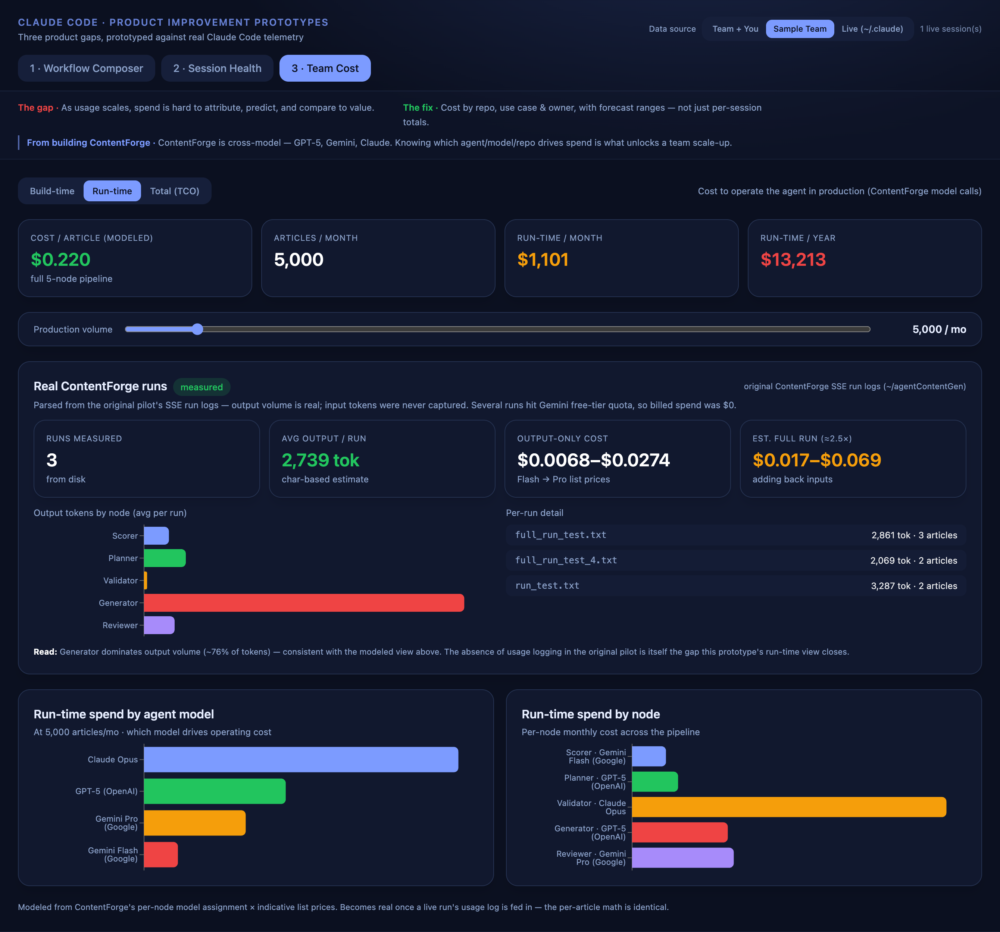

# Claude Code — Product Improvement Prototypes

Three working prototypes proposing product improvements to Claude Code. Each maps
a **real gap** in agentic development workflows to a **concrete fix**, and —
crucially — is prototyped against the **real telemetry Claude Code already emits**
(its `~/.claude` JSONL session transcripts: per-turn token usage, model, repo
path, git branch, timestamps), with a synthetic "team" dataset as a fallback so it
runs on any laptop.

| # | Pain point | Prototype |
|---|-----------|-----------|
| 1 | Can watch agents run, but can't shape how they fit together before they start | **Visual Workflow Composer & Inspector** — renders a workflow script as a DAG (phases, handoffs, parallel fan-out) *before* execution; compose steps and watch the graph update |
| 2 | In long sessions, output quality can quietly degrade before you notice | **Active Session Health** — a context-utilization gauge + zone timeline that fires a *pre-emptive* warning before the high-risk zone, plus a smart-cleanup preview that preserves decisions/constraints |
| 3 | As usage scales, spend is hard to attribute, predict, and compare to value | **Cost Attribution, Forecasting & TCO** — build-time dev spend (by repo / use case / owner) *and* an agent's run-time cost, combined into a total cost of ownership |

## Screenshots

**1 · Visual Workflow Composer & Inspector** — the dependency graph of a multi-agent workflow rendered *before* execution. Switch between bundled examples (ContentForge and Sentinel Vantage are real pilots; a code-review fan-out is a generic pattern), edit the script, or add steps — the DAG updates live. Conditional branches and parallel fan-outs render as diverging arrows.


The same composer pointed at a second pilot — **Sentinel Vantage** (MerchantMind) — showing its PII→Sheriff governance **branch** (the Route node diverges to the Analyst and the Sheriff, then reconverges):


**2 · Active Session Health** — context-utilization gauge + zone timeline. The warning fires at **turn 37**, *before* the high-risk zone — so cleanup happens while decisions are still intact, not after output degrades. Smart-cleanup preview shows what's preserved vs. compacted.


**3 · Cost Attribution, Forecasting & Total Cost of Ownership** — three modes:
- **Build-time** — what it costs to *build* with Claude Code (dev spend by repo / use case / owner + forecast)
- **Run-time** — what it costs to *operate* the agent: cost-per-article across the cross-model pipeline, scaled by a production-volume control
- **Total (TCO)** — build-time + projected run-time for the agent, so you can compare one-time dev cost against recurring operating cost (here: ~$82 to build vs ~$13k/yr to run at 5k articles/mo — and Claude validation is the biggest run-time lever)


The Run-time view also surfaces **real measured runs** from the original ContentForge pilot on disk — parsing the existing SSE logs (~/agentContentGen) to extract actual output token volume per run (avg ~2,700 tok/run; Generator drives ~76%). Honest caveat baked in: original pilot never captured input tokens or `usage_metadata`, and several runs hit Gemini free-tier quota — so billed spend was $0. The card displays the gap that motivates this prototype: usage logging at the router layer would make these numbers exact instead of estimated.



And a **"Compare to monolithic"** panel that answers the obvious follow-up — *is multi-agent worth it?* It shows the 5-agent system at three Validator tiers (Opus / Sonnet / Haiku), every reasonable monolithic single-prompt baseline (Gemini Flash, GPT-5, Gemini Pro, Opus, with/without cache), and a "fair" multi-call comparison (GPT-5 generation + Opus compliance pass). A breakeven framing translates the cost delta into the number of compliance violations the multi-agent pipeline must prevent per month to justify itself. At 2K articles/day:
- 5-agent (Opus): ~$12.6K/mo · with Sonnet validator: ~$7K/mo (a single config change saves ~44%)
- Cheapest unsafe monolithic (Flash + cache): ~$354/mo — but no independent compliance check
- "Fair" monolithic (GPT-5 + Opus compliance pass): ~$6.1K/mo — within striking distance of 5-agent w/ Sonnet
- Breakeven: prevent ~12 compliance violations/mo at $1k each to justify the multi-agent cost over a no-compliance monolithic


> Tip: tabs and data source are deep-linkable — e.g. `…/#health` or `…/?source=sample#cost`.

## Approach

These are standalone prototypes, **not** edits to Claude Code's closed source.
What grounds them: they read the product's *actual* data surface. Prototypes 2 and 3
compute real numbers from `~/.claude` history (e.g. context-load growth,
per-turn cost from token usage × list pricing); prototype 1 parses real Workflow-tool
scripts. Toggle the **data source** (Team+You / Sample Team / Live) in the header.

## Architecture

```
backend/   FastAPI — reads ~/.claude transcripts, computes cost/health/forecast,
           parses workflow scripts, and serves the built frontend on one port
frontend/  React + Vite + Tailwind + Recharts + React Flow (3 tabs)
```

## Run (one port)

```bash
# 1. backend
cd backend
python3.12 -m venv venv && source venv/bin/activate
pip install -r requirements.txt

# 2. build the frontend once (served by the backend)
cd ../frontend && npm install && npm run build

# 3. launch — open http://localhost:8000
cd ../backend && uvicorn main:app --port 8000
```

For frontend hot-reload during development, run `npm run dev` (port 5180) in a
second terminal — it proxies `/api` to the backend on 8000.

## What each prototype shows

1. **Composer** — A workflow is written as code and only observable once it runs.
   The composer renders the dependency graph first — parallel fan-out, gates,
   handoffs — so the structure (and its cost) is reviewable *before* execution.
2. **Health** — Over a 58-turn session, context climbs from healthy to 96%. The
   warning fires at **turn 37**, *before* the high-risk zone, so cleanup happens
   while key decisions are still intact rather than after output degrades.
3. **Cost** — Per-session spend is fine for one person; a team needs more. This
   separates **build-time** (what it costs to build with Claude Code, by
   repo/use-case/engineer) from **run-time** (what the agent costs to operate in
   production) and combines them into a **total cost of ownership** — so you can
   weigh one-time dev cost against recurring operating cost, and see which model
   drives the run-time bill.

## Notes

- Dollar figures use indicative published list pricing (see `backend/pricing.py`),
  isolated so they're easy to update.
- Zero real spend or API keys involved — everything is computed from local
  transcript token counts.
